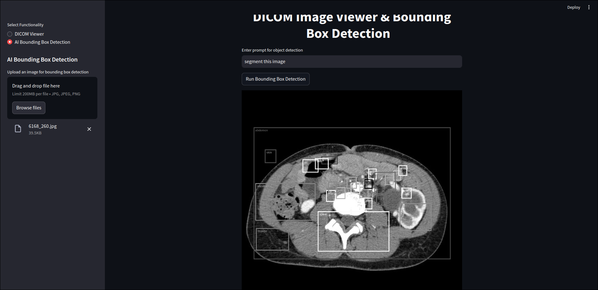

# DICOM Viewer & Bounding Box Detection Application

This Streamlit application allows users to upload and view DICOM images, as well as perform AI-based bounding box detection on uploaded images. It provides functionality for converting DICOM images to various formats and also leverages Google GenAI for object detection.




## Features

1. **DICOM Viewer**:
   - Load DICOM images from a folder.
   - View any selected DICOM image.
   - Convert DICOM images to JPG, BMP, PNG, or NumPy arrays.

2. **AI Bounding Box Detection**:
   - Upload an image for AI-based object detection.
   - Input a prompt to guide the detection.
   - Display detected objects with bounding boxes.

## Installation

To run this application, follow the steps below to set up the necessary environment:

### 1. Clone the repository

```bash
git clone https://github.com/thearpankumar/AI-Medical-Image-Scanner.git
cd AI-Medical-Image-Scanner
```

### 2. Set env-variable 

```
export GOOGLE_API_KEY="API_KEY"
```

### 3. python
```python
python -m pip install -r requirements.txt

streamlit run app.py
```

